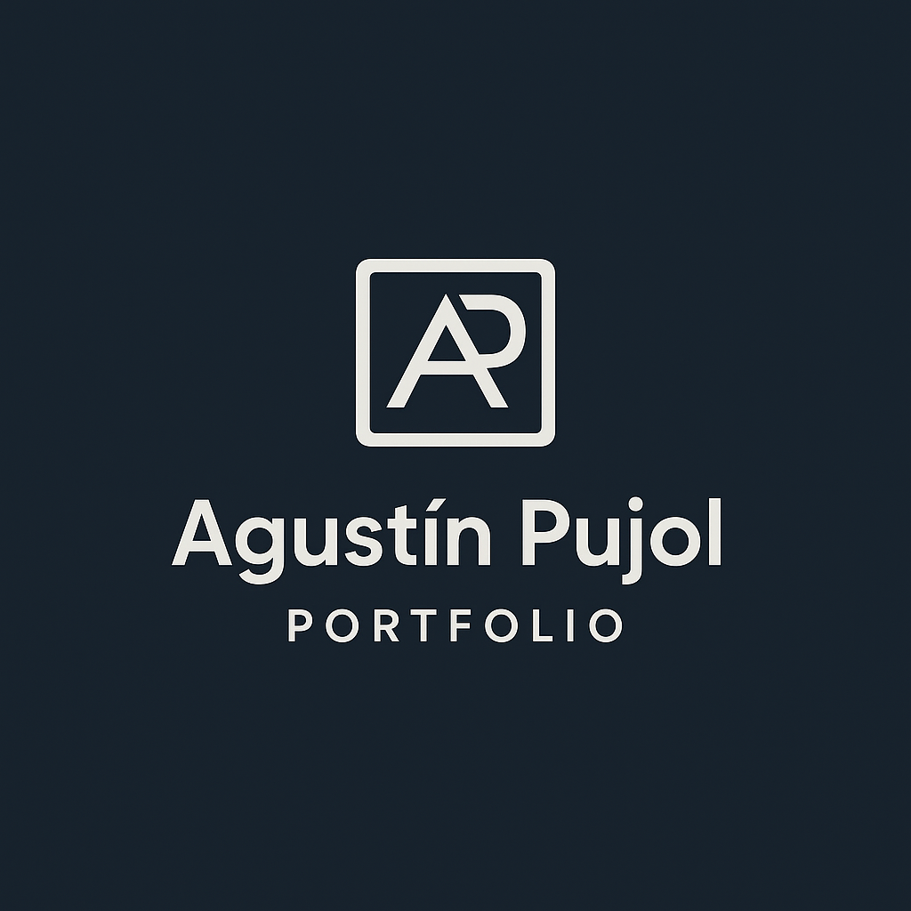
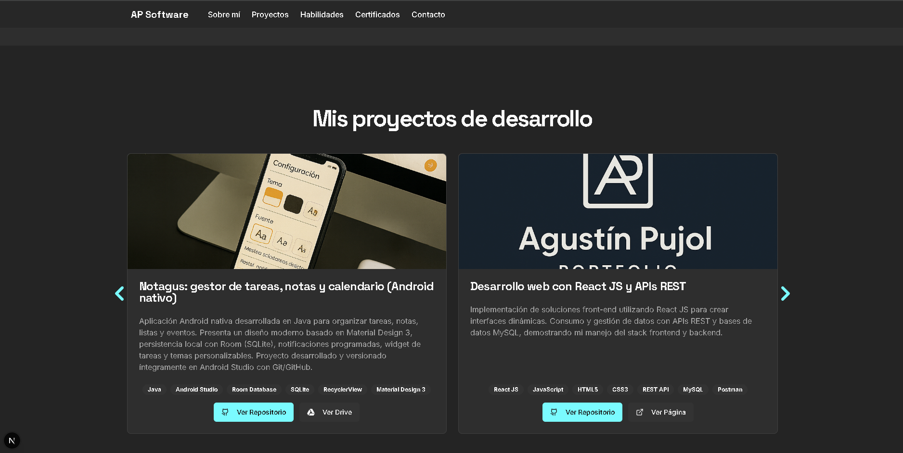

  

<h1 align="center">Portafolio Web - Agustín Pujol</h1>

  Sitio web personal desarrollado en <b>Next.js + TypeScript + Tailwind CSS</b> para presentar mis proyectos, habilidades y trayectoria como desarrollador. 
  Incluye secciones dinámicas, animaciones y componentes modernos diseñados con <b>shadcn/ui</b>.

  
  
  
  
  

---

## 🧭 Descripción

Este proyecto es mi **portafolio profesional**, diseñado para mostrar mi experiencia como **desarrollador de software** (Android, Web y UX/UI).  
Cuenta con un diseño moderno, minimalista y completamente responsive, construido sobre el stack **Next.js 15 + TypeScript + TailwindCSS**.  

Presenta una navegación fluida entre secciones, imágenes optimizadas, slider de proyectos, integración con GitHub Pages y componentes reutilizables.

---

## ✨ Secciones principales

- 🏠 **Inicio (Hero):** presentación personal con botones a GitHub y Google Drive.  
- 👤 **Sobre mí:** breve descripción, formación académica y objetivos profesionales.  
- 💻 **Proyectos:** carrusel (Swiper) con cards de mis trabajos más destacados (Android, Web, etc.).  
- ⚙️ **Habilidades:** lista de herramientas técnicas y tecnológicas dominadas.  
- 🎓 **Certificados:** sección dedicada a mostrar los cursos y certificaciones obtenidas.  
- 📬 **Contacto:** enlaces a LinkedIn, GitHub y redes profesionales.  

---

## 🧰 Tecnologías utilizadas

- **Framework principal:** Next.js 15  
- **Lenguaje:** TypeScript  
- **Estilos:** TailwindCSS + clases personalizadas  
- **UI components:** shadcn/ui + Lucide Icons + react-icons  
- **Animaciones:** Framer Motion  
- **Carrusel:** Swiper.js  
- **Deploy:** GitHub Pages con CI/CD (GitHub Actions)  
- **Imágenes:** `/public/` optimizadas y placeholders JSON  

---

## 🚀 Ejecución local
https://agustinpujol12.github.io/

---

## 🖼️ Vista previa

  

---

## ⚙️ Estructura principal

📦 **src/**  
┣ 📂 **app/** → páginas y layout principal  
┣ 📂 **components/** → secciones (hero, about, projects, etc.)  
┣ 📂 **lib/** → datos y placeholders  
┣ 📂 **styles/** → configuración Tailwind  
┗ 📂 **public/** → imágenes y recursos estáticos  

---

## 📄 Licencia

Proyecto desarrollado por **Agustín Pujol** como portfolio personal.  
Su uso está permitido con fines **educativos, demostrativos o de referencia profesional**.  
© 2025 Agustín Pujol. Todos los derechos reservados.

---

## 👨‍💻 Autor

**Agustín Pujol**  
Desarrollador de software | Android · Web · UX/UI  

[🌐 Portfolio](https://agustinpujol12.github.io)  
[💼 LinkedIn](https://www.linkedin.com/in/agustinpujol/)  
[🐙 GitHub](https://github.com/Agustinpujol12)
